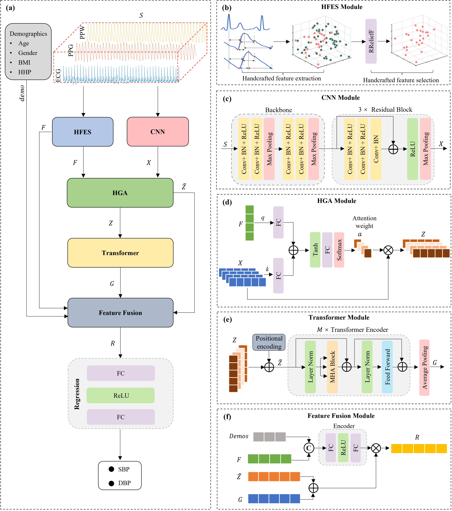

# HGCTNet: Handcrafted Feature-Guided CNN and Transformer Network for Wearable Cuffless Blood Pressure Measurement

## Abstract
Waiting for update...

## Methodology
The proposed HGCTNet comprises several modules: handcrafted feature extraction and selection (HFES), CNN, handcrafted feature-guided (HGA), transformer, feature fusion, and regression.

  

## Dataset
Two wearable blood pressure datasets were used in this study:
- [Aurora-BP Dataset](https://github.com/microsoft/aurorabp-sample-data)
- [CAS-BP Dataset](https://github.com/zdzdliu/CAS-BP)
